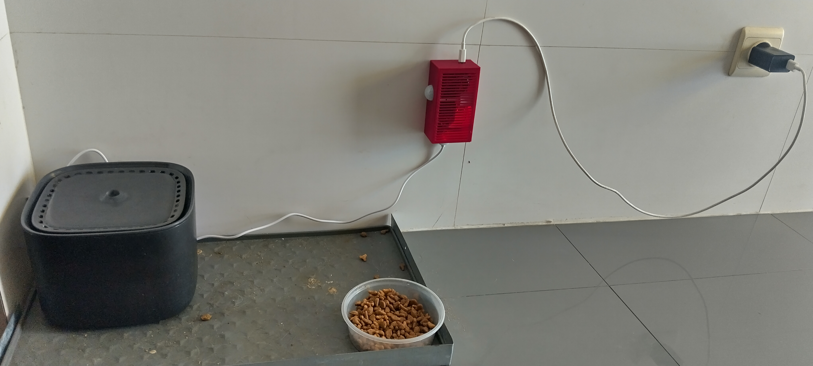
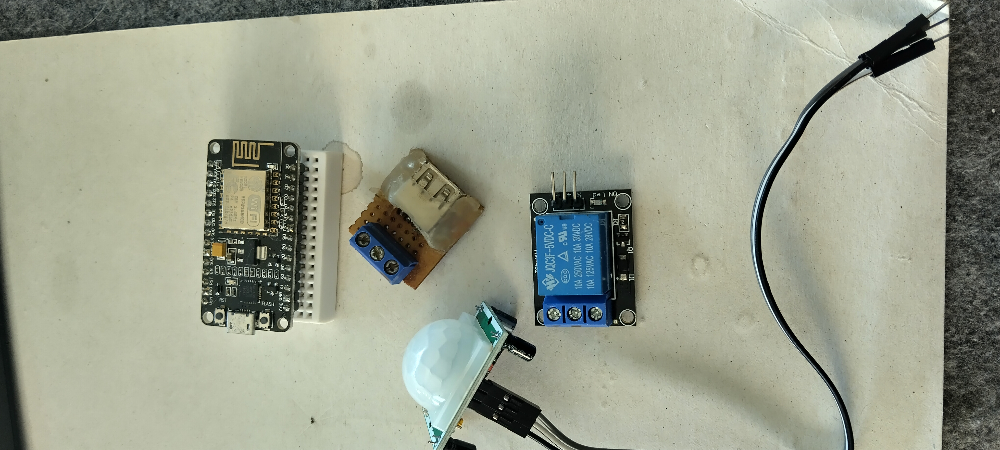
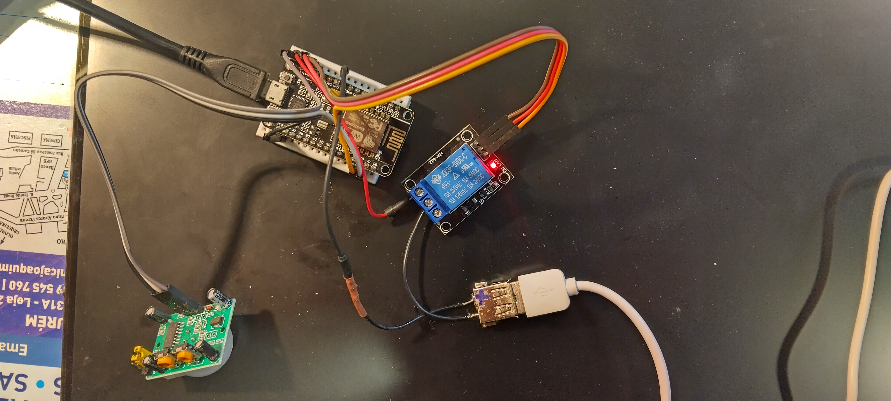
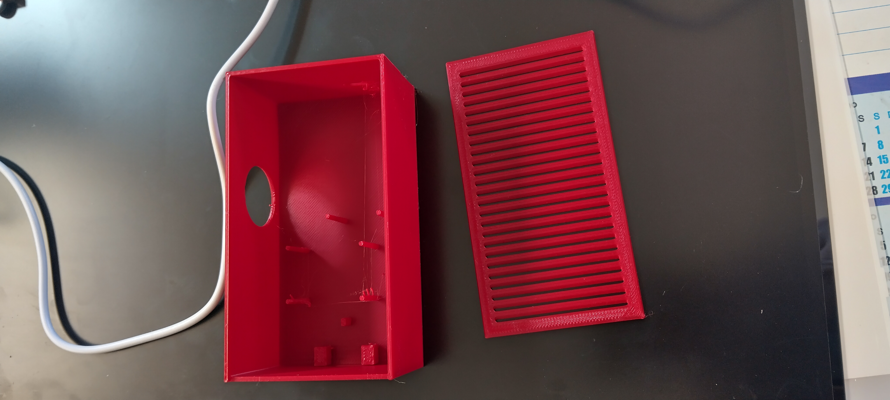
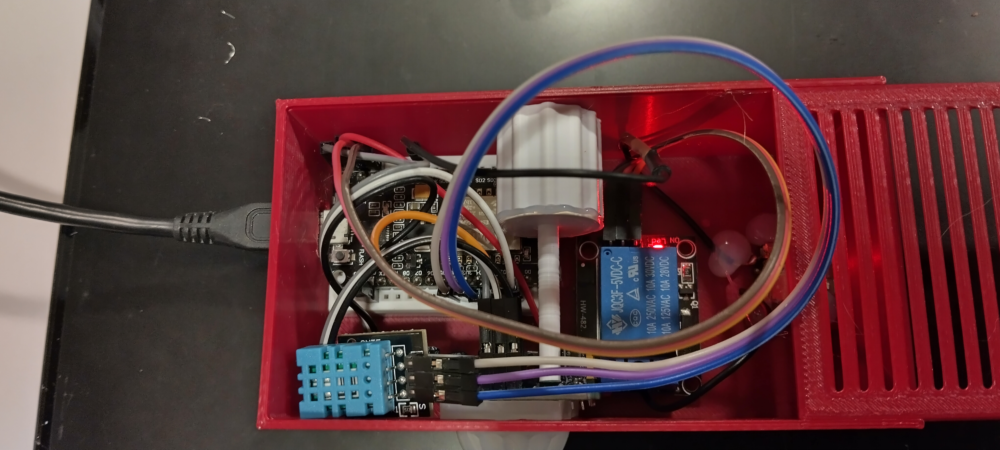

# 🐾 Smart Pet Fountain & Environment Monitor (ESP8266 + MQTT)

This project transforms a standard pet water fountain into an intelligent, motion-activated system. It also functions as a home automation node by monitoring ambient temperature and humidity.

The system uses a **PIR sensor** for motion detection, a **Relay** to control the 5V pump, and a **DHT11 sensor** for environmental data, all integrated via **MQTT** into a local broker (e.g., Home Assistant).

## 🚀 Key Features
*   **Motion Activation:** The fountain turns on automatically when the pet is detected within range.
*   **Smart Timeout:** Stays active for **2 minutes** after the last detected movement to ensure a full drinking and filtering cycle.
*   **Environmental Monitoring:** Integrated DHT11 sensor provides real-time temperature and humidity updates every 5 seconds.
*   **MQTT Connectivity:** Publishes binary states ("1"/"0") and sensor values to a local broker.
*   **Self-Healing Logic:** Automatically restarts every 3 hours to ensure long-term stability and prevent network or memory hang-ups.

## 🛠️ Hardware Components
*   **Microcontroller:** NodeMCU v3 (ESP8266)
*   **Sensors:** PIR HC-SR501 and DHT11 (Temperature/Humidity)
*   **Actuator:** 5V Relay Module
*   **Power Output:** USB-A Breakout (to power the original fountain pump)
*   **Case:** Custom 3D-printed enclosure designed in Tinkercad

## 🔌 Wiring and Prototyping
The NodeMCU powers the entire circuit through the **VIN** pin, providing 5V directly from the Micro-USB power input. This ensures stable voltage for the Relay and the sensors.

| Component | Signal Pin | NodeMCU Pin | MQTT Topic |
| :--- | :--- | :--- | :--- |
| **PIR HC-SR501** | OUT | **D1 (GPIO5)** | `home/pir1` |
| **DHT11** | DATA | **D4 (GPIO2)** | `home/temp/2` & `home/hum/2` |
| **Relay** | IN | **D2 (GPIO4)** | - |

## 📦 Enclosure and 3D Assembly
The electronics are protected by a custom red 3D-printed case. The design features:
*   **Ventilation Slats:** Prevents heat buildup to ensure accurate DHT11 readings.
*   **Side Port:** For the PIR Fresnel lens.
*   **Cable Management:** Openings for the main power input and the USB pump output.

## 💻 Software Setup
Developed in **C++/Arduino IDE**, the code utilizes the `PubSubClient` and `DHT sensor library`.

### MQTT Communication
The device publishes to the following topics:
*   `home/pir1`: Sends `1` (Motion/ON) or `0` (Standby/OFF).
*   `home/temp/2`: Current ambient temperature in Celsius.
*   `home/hum/2`: Relative humidity percentage.
*   `home/status`: Reports `online` or `restarting`.

---
**Author:** Rui Manuel Marques Pires  
**License:** MIT
